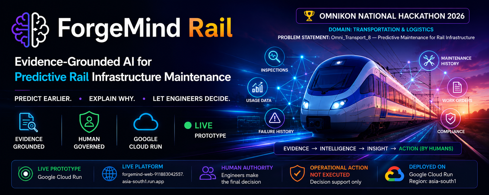
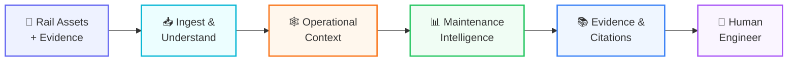
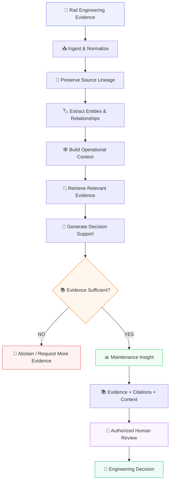
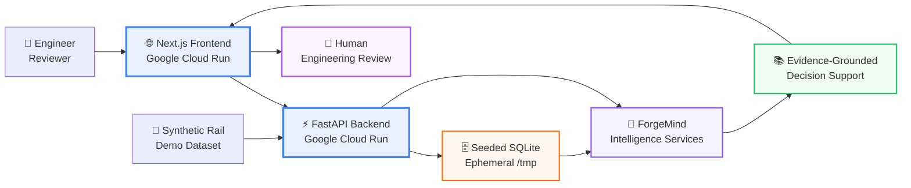
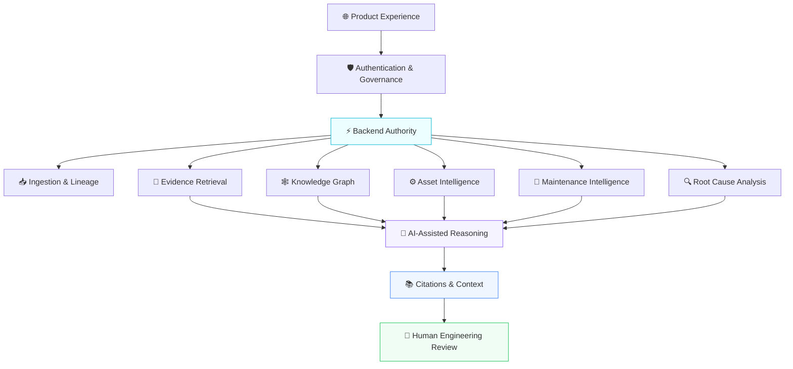
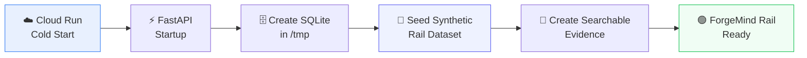

<div align="center">



<br/>

# 🚆 ForgeMind Rail

### 🧠 Evidence-Grounded AI for Predictive Rail Infrastructure Maintenance

**Omnikon National Hackathon 2026 · Transportation & Logistics**

> ### **Predict earlier. Explain why. Let engineers decide.**

<br/>

<a href="https://forgemind-web-911883042537.asia-south1.run.app/platform/dashboard">
  
</a>


<br/><br/>


<br/><br/>

### 🟢 **LIVE PROTOTYPE · GOOGLE CLOUD RUN**

### 🛑 **OPERATIONAL ACTION: NOT EXECUTED**

</div>

---

# 🚀 Live Demo

<table>
<tr>
<td width="64%" valign="top">

## 🌐 ForgeMind Rail Platform

ForgeMind Rail is deployed as a **working public prototype on Google Cloud Run**.

The platform transforms fragmented railway engineering, inspection, usage, maintenance, failure, asset and compliance evidence into **traceable, evidence-grounded maintenance decision support**.

### 👉 [**Launch ForgeMind Rail →**](https://forgemind-web-911883042537.asia-south1.run.app/platform/dashboard)

</td>

<td width="36%" valign="top">

### 🟢 Current Status

| Component | Status |
|---|---|
| 🌍 Public prototype | **LIVE** |
| ☁️ Runtime | **Google Cloud Run** |
| 🚆 Application | **ForgeMind Rail** |
| 🧠 Intelligence | **AI-assisted** |
| 👤 Final authority | **Human engineer** |
| 🛑 Autonomous action | **Not provided** |

</td>
</tr>
</table>

> [!IMPORTANT]
> **ForgeMind Rail is an engineering decision-support prototype.**
>
> It is not a production railway deployment, certified railway safety system, autonomous train-control system, or autonomous maintenance authority.

---

# 🏆 Omnikon National Hackathon 2026

| | |
|---|---|
| 🏁 **Hackathon** | Omnikon National Hackathon 2026 |
| 🚚 **Domain** | Transportation & Logistics |
| 🎯 **Problem Statement** | `Omni_Transport_8 — Predictive Maintenance for Rail Infrastructure` |
| 🚆 **Solution** | ForgeMind Rail |
| 🧠 **Approach** | Evidence-grounded predictive maintenance intelligence |
| ☁️ **Deployment** | Google Cloud Run |
| 👤 **Decision Boundary** | Human governed |

---

# 🎯 The Rail Maintenance Problem

Railway infrastructure produces large volumes of engineering evidence:

- 🔍 inspection records
- 📈 usage history
- ⚠️ failure records
- 🔧 maintenance history
- 🛠️ work orders
- 📄 engineering documents
- 📋 procedures
- ⚖️ compliance information

Yet these records can remain distributed across documents, systems and teams.

Important early-warning signals may therefore exist individually without being connected into a complete maintenance picture.

> ### **The challenge is not merely collecting more data.**
>
> ### **The challenge is connecting the right evidence early enough to support better maintenance decisions.**

A maintenance score alone is not enough.

Engineers also need to understand:

- **Which asset requires attention?**
- **Why has the asset been prioritized?**
- **What inspection evidence supports the concern?**
- **What usage or loading history is relevant?**
- **Has the failure occurred before?**
- **Which work orders are connected?**
- **What engineering evidence supports the recommendation?**
- **How confident should the engineer be?**

ForgeMind Rail is designed around these questions.

---

# 💡 The ForgeMind Rail Approach

<div align="center">

## **From fragmented rail evidence → to explainable maintenance intelligence**

</div>



<div align="center">

### **Predict earlier → Explain why → Show the evidence → Let engineers decide**

</div>

---

# ✨ Why ForgeMind Rail Is Different

<table>

<tr>

<td width="50%" valign="top">

## 📚 01 · Evidence Before Answers

ForgeMind Rail is designed around traceable engineering evidence rather than unsupported AI output.

Insights are connected to source information wherever the application workflow provides supporting evidence.

</td>

<td width="50%" valign="top">

## ⚙️ 02 · Asset-Centric Intelligence

Inspection, usage, failure, maintenance and work-order information can be investigated around the railway asset instead of remaining isolated records.

</td>

</tr>

<tr>

<td width="50%" valign="top">

## 🕸️ 03 · Connected Operational Context

Entity relationships and knowledge-graph views help expose connections across assets, failures, procedures, inspections and work orders.

</td>

<td width="50%" valign="top">

## 🔍 04 · Explainable Maintenance Support

The objective is not simply to produce a risk indicator.

ForgeMind Rail helps engineers investigate **why an asset is being surfaced and what evidence supports the concern**.

</td>

</tr>

<tr>

<td width="50%" valign="top">

## 🛡️ 05 · Governance by Design

Authentication, role-aware access, evidence sufficiency, citations, abstention and human review form part of the decision-support architecture.

</td>

<td width="50%" valign="top">

## 👤 06 · Human Authority

ForgeMind Rail supports engineering judgment.

It does not autonomously approve maintenance, actuate railway equipment or control trains.

</td>

</tr>

</table>

---

# 🔄 End-to-End Intelligence Workflow



---

# 🧠 ForgeMind AI → 🚆 ForgeMind Rail

**ForgeMind AI** provides the underlying evidence-grounded industrial intelligence foundation.

**ForgeMind Rail** applies that foundation to the Omnikon predictive rail infrastructure maintenance challenge.

```text
🧠 ForgeMind AI
│
├── 📥 Evidence ingestion
├── 🔗 Source lineage
├── 🔎 Evidence retrieval
├── 📚 Citations
├── 🏷️ Entity intelligence
├── 🕸️ Knowledge graph
├── ⚙️ Asset intelligence
├── 🔧 Maintenance intelligence
├── 🔍 Root-cause analysis
├── 🛡️ Governance
└── 👤 Human review
        │
        ▼
🚆 ForgeMind Rail
│
├── Rail asset context
├── Inspection evidence
├── Usage evidence
├── Failure history
├── Maintenance history
├── Work-order context
└── Predictive-maintenance decision support
```

---

# 🌟 Key Capabilities

<table>

<tr>

<td width="50%" valign="top">

## 🎛️ Executive Cockpit

- Operational overview
- Rail asset context
- Maintenance indicators
- Risk visibility
- Evidence statistics
- Decision-support summaries

</td>

<td width="50%" valign="top">

## 📄 Engineering Documents

- Evidence ingestion
- Source lineage
- Document identity
- SHA-256 integrity support
- Chunk extraction
- Evidence traceability

</td>

</tr>

<tr>

<td width="50%" valign="top">

## 🧠 Knowledge Copilot

- Evidence-grounded responses
- Context-aware retrieval
- Supporting citations
- Confidence context
- Evidence insufficiency handling
- Abstention behavior

</td>

<td width="50%" valign="top">

## 🕸️ Knowledge Graph

Connect:

- assets
- failures
- procedures
- inspections
- work orders
- regulations
- engineering evidence

</td>

</tr>

<tr>

<td width="50%" valign="top">

## ⚙️ Asset 360

- Unified asset context
- Usage history
- Inspection evidence
- Failure history
- Maintenance records
- Work-order context
- Related evidence

</td>

<td width="50%" valign="top">

## 🔧 Maintenance Intelligence

- Maintenance history
- Repeated-failure context
- Usage context
- Maintenance prioritization
- Risk-oriented investigation
- Evidence-linked review

</td>

</tr>

<tr>

<td width="50%" valign="top">

## 🔍 Root Cause Analysis

- Evidence-supported investigation
- Failure relationships
- Connected events
- Supporting engineering records
- Structured investigation workflow

</td>

<td width="50%" valign="top">

## 🛡️ Compliance & Governance

- Applicable evidence
- Compliance context
- Evidence gaps
- Role-aware access
- Auditability
- Human review boundary

</td>

</tr>

</table>

---

# ☁️ Live Architecture — Google Cloud Run

> [!IMPORTANT]
> The diagram below represents the **current public prototype deployment architecture**.
>
> It intentionally does not claim Cloud SQL, Vertex AI, Memorystore or other managed Google Cloud services that are not required by the current prototype.



## ☁️ Current Deployment

| Layer | Current Implementation |
|---|---|
| 🌐 Frontend | Next.js on **Google Cloud Run** |
| ⚡ Backend | FastAPI on **Google Cloud Run** |
| 🗄️ Demo database | Seeded SQLite |
| 💾 Writable runtime location | `/tmp` |
| 🔄 Cold-start recovery | Deterministic demo reseeding |
| 📦 Container images | Docker |
| 🏗️ Image repository | Google Artifact Registry |
| 🔨 Build support | Google Cloud Build |
| 🌍 Region | `asia-south1` |
| 👤 Decision authority | Human |

---

# 🌐 Public Deployment

<div align="center">

## 🟢 **FORGEMIND RAIL IS LIVE**

### ☁️ Google Cloud Run · `asia-south1`

<br/>

### 👉 [**OPEN LIVE PLATFORM**](https://forgemind-web-911883042537.asia-south1.run.app/platform/dashboard)

<br/>

**Public Frontend**

`https://forgemind-web-911883042537.asia-south1.run.app`

<br/>

**Dashboard**

`https://forgemind-web-911883042537.asia-south1.run.app/platform/dashboard`

</div>

---

# 🔐 Evidence-Grounded AI Architecture



<div align="center">

## **Models explain. Evidence supports. Backend gates. Humans authorize.**

</div>

---

# 🚦 Human Decision Boundary

<table>

<tr>

<td width="50%" valign="top">

## 🟢 AI CAN

- Retrieve relevant evidence
- Connect related records
- Explain evidence context
- Identify patterns
- Surface maintenance concerns
- Assist root-cause analysis
- Support compliance investigation
- Generate cited recommendations
- Prepare decision-support information

</td>

<td width="50%" valign="top">

## 🔴 AI CANNOT

- Control trains
- Operate signalling equipment
- Actuate railway equipment
- Start or stop machinery
- Isolate systems
- Repair infrastructure
- Approve maintenance
- Override access controls
- Modify safety-critical configuration
- Execute production actions

</td>

</tr>

</table>

<div align="center">

# 👤 **HUMANS DECIDE**

## 🛑 **OPERATIONAL ACTION: NOT EXECUTED**

</div>

---

# 🚆 Synthetic Rail Demonstration Dataset

The [`demo-data/rail/`](demo-data/rail/) directory contains the synthetic dataset used to demonstrate the Omnikon predictive-maintenance workflow.

The Cloud Run backend deterministically seeds the demonstration environment during startup.

### Demonstration dataset

| Rail Evidence | Seeded Data |
|---|---:|
| 🚆 Rail assets | **8** |
| ⚠️ Rail failures | **8** |
| 🔍 Rail inspections | **10** |
| 🛠️ Rail work orders | **8** |
| 📈 Asset usage records | **11** |
| 📄 Usage evidence | `rail_usage.csv` |

Example asset identifiers include:

```text
TRK-001
...
OCS-008
```

Example verified demonstration evidence:

```text
Asset: TRK-001
Period: 2025-Q4
Gross tonnage: 13,200,000 tonnes
Source evidence: rail_usage.csv
```

> [!CAUTION]
> The railway dataset is **synthetic**.
>
> It does not contain operational data from a real railway, metro operator or infrastructure owner.

---

# 🔄 Deterministic Cloud Startup

The hackathon deployment deliberately uses a lightweight reproducible runtime.



Runtime configuration is designed around writable ephemeral storage such as:

```text
DATABASE_URL=sqlite:////tmp/forgemind.db
FORGEMIND_DATA_DIR=/tmp/data
FORGEMIND_UPLOAD_DIR=/tmp/uploads
SEED_DEMO_ON_STARTUP=true
```

> [!NOTE]
> Cloud Run local filesystem persistence is **ephemeral**.
>
> The prototype therefore recreates its synthetic demonstration state deterministically after a new container starts.
>
> **Durable production persistence is not claimed.**

---

# 📊 Existing ForgeMind Evidence Baseline

The underlying ForgeMind development corpus includes the following locally verified evidence counts:

<div align="center">

| Evidence Type | Verified Count |
|---|---:|
| 📄 Documents | **29** |
| 🧩 Chunks | **969** |
| 🏷️ Entities | **552** |
| 🔗 Entity relationships | **122** |
| 📚 Citations | **124** |
| ⚙️ Assets | **12** |
| ⚠️ Failures | **16** |
| 🛠️ Work orders | **5** |
| 🔍 Inspections | **6** |
| 📋 Procedures | **2** |
| ⚖️ Regulations | **10** |

</div>

> These figures describe the existing ForgeMind development evidence corpus.
>
> **They are not rail predictive-maintenance accuracy metrics.**

A ForgeMind citation is a traceable reference from an analytical or generated output to supporting ingested evidence.

It is **not an academic citation count**.

---

# 🔎 Evaluation Evidence

> [!NOTE]
> The existing eight-case local retrieval corpus is a **development smoke test**.
>
> It must not be interpreted as a railway predictive-maintenance benchmark.

| Metric | Verified Local Result |
|---|---:|
| ✅ Cases passed | **8 / 8** |
| 🎯 Positive retrieval cases | **6** |
| 🛑 Negative abstention cases | **2** |
| 📈 Mean Recall@5 | **1.00** |
| 🥇 Mean Reciprocal Rank | **1.00** |
| ✅ Negative abstention accuracy | **1.00** |
| ⚡ Retrieval latency p50 | **1.68 ms** |
| ⚡ Retrieval latency p95 | **1.73 ms** |

Evaluation artifact:

```text
backend/evaluation/results/local_phase3.json
```

Research methodology:

📘 [`docs/CONFERENCE_RESEARCH_PLAN.md`](docs/CONFERENCE_RESEARCH_PLAN.md)

---

# 🧪 Cloud Acceptance Scenario

The Cloud Run deployment was designed around an end-to-end rail demonstration scenario.

## 🎯 Supported Evidence Query

```text
What was the gross tonnage for TRK-001 in 2025-Q4?
```

Expected evidence-backed result:

```text
13,200,000 tonnes
```

Supporting source:

```text
rail_usage.csv
```

## 🛑 Abstention Scenario

```text
What is the inspection frequency of XYZ-999?
```

Expected behavior:

- no fabricated asset
- no fabricated evidence
- no fabricated citation
- low-confidence / unsupported response
- abstention or refusal to infer unsupported information

This distinction is fundamental to the ForgeMind architecture:

> ### **When evidence is insufficient, the system should not manufacture certainty.**

---

# 🎬 Guided Product Demo

## ⚡ Recommended 5-Minute Judge Flow

| Step | Experience | Demonstrate |
|---:|---|---|
| **1** | 🎛️ Executive Cockpit | Operational overview |
| **2** | 📄 Engineering Documents | Evidence and source lineage |
| **3** | 🧠 Knowledge Copilot | Evidence-grounded answer |
| **4** | 🕸️ Knowledge Graph | Connected operational context |
| **5** | ⚙️ Asset 360 | Unified rail asset intelligence |
| **6** | 🔧 Maintenance AI | Maintenance context and priorities |
| **7** | 🔍 Root Cause Analysis | Evidence-supported investigation |
| **8** | 🛡️ Compliance | Governance and supporting evidence |
| **9** | 📊 Evidence Metrics | Retrieval and abstention behavior |
| **10** | 👤 Human Boundary | Engineer retains authority |

---

# 🧭 Product Routes

| Product Area | Route |
|---|---|
| 🏠 Landing | `/` |
| 🎛️ Executive Cockpit | `/platform/dashboard` |
| 🧠 Knowledge Copilot | `/platform/copilot` |
| 📄 Engineering Documents | `/platform/documents` |
| 🕸️ Knowledge Graph | `/platform/graph` |
| 🧩 Entity Intelligence | `/platform/entities` |
| ⚙️ Digital Twin / Assets | `/platform/assets` |
| 🔧 Maintenance AI | `/platform/maintenance` |
| 🔍 Root Cause Analysis | `/platform/rca` |
| 🛡️ Compliance | `/platform/compliance` |
| 📚 Lessons Learned | `/platform/lessons` |
| 📊 Reports | `/platform/reports` |
| 🧪 Evidence Metrics | `/platform/evaluation` |
| 🔐 Administration | `/platform/admin` |

---

# 🧱 Technology Stack

| Layer | Technology |
|---|---|
| 🌐 Experience | Next.js 15, React 18, TypeScript, Tailwind CSS |
| 📊 Visualization | TanStack Query, Recharts, React Flow, D3 |
| ⚡ API | Python, FastAPI, Pydantic |
| 🗄️ Application persistence | SQLAlchemy / SQLite |
| 🚆 Demo runtime database | Seeded SQLite in Cloud Run writable `/tmp` |
| 📚 Evidence | Local/synthetic demonstration evidence |
| 🧠 Intelligence | ForgeMind deterministic and AI-assisted services |
| 🔐 Access control | JWT / RBAC application controls |
| 📦 Packaging | Docker |
| ☁️ Runtime | **Google Cloud Run** |
| 🏗️ Container registry | Google Artifact Registry |
| 🔨 Cloud build | Google Cloud Build |
| 🧪 Quality | Pytest, Python compile checks, TypeScript, Next.js build |

> [!IMPORTANT]
> The presence of code, infrastructure files or architectural documentation for another cloud service does not mean that service is part of the current live prototype.
>
> The current public deployment claim is intentionally limited to the **verified Google Cloud Run deployment**.

---

# 🏗️ Repository Structure

```text
ForgeMind-AI/
│
├── 🌐 frontend/
│   └── Next.js / React / TypeScript product experience
│
├── 🧠 backend/
│   └── FastAPI APIs and ForgeMind intelligence services
│
├── 🚆 demo-data/
│   └── Synthetic rail demonstration dataset
│
├── 📚 sample_data/
│   └── Local evidence examples
│
├── 📘 docs/
│   └── Architecture, API, deployment, research and demo documentation
│
├── 🏗️ infra/
│   └── Infrastructure / reference deployment definitions
│
├── ⚙️ .github/workflows/
│   └── CI/CD and deployment workflow definitions
│
├── 🔐 SECURITY.md
├── 📄 LICENSE
├── 🐳 docker-compose.yml
├── ⚙️ .env.example
└── 📖 README.md
```

---

# 💻 Local Development

## Prerequisites

- Python **3.11+**
- Node.js **20+**
- pnpm

Clone the repository:

```bash
git clone https://github.com/Janicebenita/ForgeMind-AI.git
cd ForgeMind-AI
```

Copy:

```text
.env.example
```

to:

```text
.env
```

---

## ⚡ Backend

### Windows PowerShell

```powershell
Set-Location backend

python -m venv .venv

.\.venv\Scripts\Activate.ps1

python -m pip install -r requirements.txt

python -m uvicorn app.main:app --reload --host 127.0.0.1 --port 8000
```

Backend API:

```text
http://localhost:8000
```

FastAPI documentation:

```text
http://localhost:8000/docs
```

---

## 🌐 Frontend

```powershell
Set-Location frontend

corepack enable

pnpm install

pnpm dev
```

Open:

```text
http://localhost:3000
```

Dashboard:

```text
http://localhost:3000/platform/dashboard
```

---

# 🐳 Docker

The repository includes containerized application support.

Where appropriate for the local environment:

```bash
docker compose up --build
```

The deployed Cloud Run environment uses containerized frontend and backend services.

---

# 🧪 Testing & Verification

Backend:

```powershell
python -m pytest backend/tests -q
```

Python compilation:

```powershell
python -m compileall -q backend/app backend/tests
```

Frontend:

```powershell
Set-Location frontend

pnpm build
```

The repository has undergone backend and frontend verification during development.

Test results establish software behavior within the tested scope.

They do **not** constitute:

- railway safety certification
- railway operational validation
- field predictive-maintenance accuracy
- regulatory approval
- production cybersecurity certification

---

# ☁️ Deployment Architecture

```text
                    INTERNET
                        │
                        ▼
              ┌───────────────────┐
              │   👷 USER /       │
              │   ENGINEER        │
              └─────────┬─────────┘
                        │
                        ▼
          ┌───────────────────────────┐
          │ 🌐 FORGEMIND WEB          │
          │ Next.js                   │
          │ Google Cloud Run          │
          └─────────────┬─────────────┘
                        │
                        ▼
          ┌───────────────────────────┐
          │ ⚡ FORGEMIND API          │
          │ FastAPI                   │
          │ Google Cloud Run          │
          └─────────────┬─────────────┘
                        │
             ┌──────────┴───────────┐
             │                      │
             ▼                      ▼
    ┌─────────────────┐    ┌──────────────────┐
    │ 🗄️ SEEDED       │    │ 🧠 FORGEMIND     │
    │ SQLITE          │    │ INTELLIGENCE     │
    │ /tmp runtime    │    │ SERVICES         │
    └────────┬────────┘    └─────────┬────────┘
             │                       │
             └───────────┬───────────┘
                         ▼
               ┌───────────────────┐
               │ 📚 EVIDENCE-      │
               │ GROUNDED OUTPUT   │
               └─────────┬─────────┘
                         │
                         ▼
               ┌───────────────────┐
               │ 👤 HUMAN REVIEW   │
               └───────────────────┘
```

---

# 🔵 Reference / Alternative Architecture Material

The repository may retain infrastructure or documentation created during earlier Azure architecture work.

Those files represent a **reference or alternative enterprise deployment architecture**.

They do **not** describe the current public runtime.

<div align="center">

| Architecture | Current Meaning |
|---|---|
| ☁️ **Google Cloud Run** | 🟢 **Current live prototype** |
| 🔵 **Azure architecture material** | 📘 **Reference / alternative architecture** |
| 🔵 **Azure runtime** | **Not the current live runtime** |

</div>

> [!WARNING]
> Azure Bicep templates, Azure AI Search references, Microsoft Foundry references, Azure PostgreSQL designs, Container Apps designs or Azure deployment workflows must not be interpreted as evidence that those services currently power the public ForgeMind Rail prototype.

---

# 🛡️ Safety & Governance

ForgeMind Rail is designed as **engineering decision support**.

The architecture includes or represents controls such as:

- 🔑 Authentication
- 🛡️ Role-based access control
- 🔒 Backend-authoritative access logic
- 🔎 Role-aware evidence retrieval
- 🔗 Source lineage
- 📚 Citation support
- 🛑 Evidence-sufficiency handling
- 🧠 AI advisory behavior
- 👤 Human review
- 🚫 Explicit non-execution boundary

> ### **No AI-generated output should be interpreted as permission to execute a railway maintenance or safety-critical action.**

---

# ⚠️ Known Limitations

ForgeMind Rail intentionally documents the boundaries of the current prototype.

### 🚆 Data

- The rail demonstration dataset is synthetic.
- It does not represent a real railway or metro operator.
- Real-world predictive performance has not been established by the synthetic demonstration.

### 🧪 Evaluation

- The existing eight-case retrieval evaluation is a development smoke test.
- It is not a held-out railway predictive-maintenance benchmark.
- Existing ForgeMind evidence counts are not predictive-maintenance accuracy metrics.

### ☁️ Cloud Runtime

- The public prototype runs on Google Cloud Run.
- The current demo database uses ephemeral SQLite storage.
- Runtime-created data may be lost when a container instance is replaced.
- Synthetic demonstration state is recreated through deterministic startup seeding.
- Durable production persistence is not claimed.

### 🧠 AI

- AI-generated outputs are advisory.
- Evidence insufficiency should result in abstention rather than fabrication.
- AI output requires engineering review.

### 🛡️ Railway Safety

ForgeMind Rail does not:

- control trains
- control signalling
- actuate railway equipment
- automatically approve maintenance
- replace qualified railway engineers
- claim railway safety certification

### 🏭 Production Readiness

A real railway deployment would require additional work including:

- representative railway field data
- held-out validation
- durable persistence
- enterprise identity
- production cybersecurity controls
- monitoring and incident management
- operator-system integration
- railway-domain validation
- safety engineering
- applicable regulatory and certification processes

---

# 📚 Documentation

| Document | Purpose |
|---|---|
| 🚆 [`docs/OMNIKON_2026.md`](docs/OMNIKON_2026.md) | Omnikon problem statement and rail solution |
| 🧱 [`docs/ARCHITECTURE.md`](docs/ARCHITECTURE.md) | Application architecture |
| 🧠 [`docs/SYSTEM_DESIGN.md`](docs/SYSTEM_DESIGN.md) | Product-level system design |
| ⚡ [`docs/API.md`](docs/API.md) | Backend API reference |
| 🗃️ [`docs/DATABASE_DIAGRAM.md`](docs/DATABASE_DIAGRAM.md) | Persistence entities |
| 🚀 [`docs/DEPLOYMENT_GUIDE.md`](docs/DEPLOYMENT_GUIDE.md) | Deployment guidance |
| 🎬 [`docs/DEMO_SCRIPT.md`](docs/DEMO_SCRIPT.md) | Demonstration sequence |
| 🧪 [`docs/CONFERENCE_RESEARCH_PLAN.md`](docs/CONFERENCE_RESEARCH_PLAN.md) | Evaluation methodology |
| 🗄️ [`docs/MIGRATION_REPORT.md`](docs/MIGRATION_REPORT.md) | Migration evidence |
| 🔐 [`SECURITY.md`](SECURITY.md) | Security and governance |

---

# 🖼️ Visual Assets

The public README is designed around the following ForgeMind Rail visual assets:

```text
docs/assets/
│
├── forgemind-rail-hero.gif
├── forgemind-rail-live-architecture.png
├── forgemind-rail-workflow.png
├── forgemind-evidence-lifecycle.png
├── forgemind-human-boundary.png
└── forgemind-rail-demo.gif
```

> Some of these assets may be added progressively.
>
> All new architecture artwork should represent **ForgeMind Rail + Google Cloud Run** as the current live prototype.

---

# 🎬 Product Demo Video

<div align="center">

## 🎥 **ForgeMind Rail Product Walkthrough**

A complete demonstration can showcase:

**Executive Cockpit → Documents → Copilot → Knowledge Graph → Asset 360 → Maintenance Intelligence → RCA → Compliance → Human Decision**

</div>

When the product demonstration video is available, place it under:

```text
docs/demo/
```

Recommended repository structure:

```text
docs/
└── demo/
    └── forgemind-rail-product-demo.mp4
```

---

# 🤖 Generative AI Usage Disclosure

Generative AI tools, including OpenAI Codex and other AI-assisted software-engineering tools, were used during development for assistance with:

- code generation
- refactoring
- debugging
- documentation
- testing support
- architecture refinement

All architecture decisions, engineering review, validation and hackathon submission responsibility remain with the registered team.

AI-generated outputs within ForgeMind Rail are **advisory** and remain subject to evidence review and authorized human engineering judgment.

---

# 👥 Omnikon 2026 Team

<div align="center">

## 🚆 **ForgeMind Rail**

### Omnikon National Hackathon 2026

<br/>

| Role | Team Member |
|---|---|
| 🚆 **Team Leader** | **Janice Benita F** |
| 💻 **Frontend Development** | **Tytus Glastin** — [@TytusGlastin](https://github.com/TytusGlastin) |

</div>

---

# 📄 License

ForgeMind AI / ForgeMind Rail is released under the [MIT License](LICENSE).

Third-party libraries, services, trademarks, datasets and external materials remain subject to their respective licenses and terms.

---

# 🌟 Project Vision

<div align="center">

## **Rail maintenance should not depend on isolated evidence.**

### ForgeMind Rail connects the evidence.

### AI helps understand the context.

### The platform explains the concern.

### The engineer makes the decision.

<br/>

# 🚆 **Predict Earlier. Explain Why. Act with Evidence.**

</div>

---

<div align="center">

# 🚆 ForgeMind Rail

### **Evidence-Grounded AI for Predictive Rail Infrastructure Maintenance**

<br/>

### 📚 **Connect evidence.**

### 🧠 **Understand operations.**

### 🔍 **Explain maintenance risk.**

### 👤 **Let engineers decide.**

<br/>


<br/><br/>

### 👉 [**🚀 Launch Live ForgeMind Rail**](https://forgemind-web-911883042537.asia-south1.run.app/platform/dashboard)

<br/>

**Omnikon National Hackathon 2026 · Transportation & Logistics**

<br/>

### **Evidence Grounded · Human Governed · Google Cloud Run · Live Prototype**

<br/>

⭐ **If ForgeMind Rail is useful to your work, consider starring the repository.**

</div>
