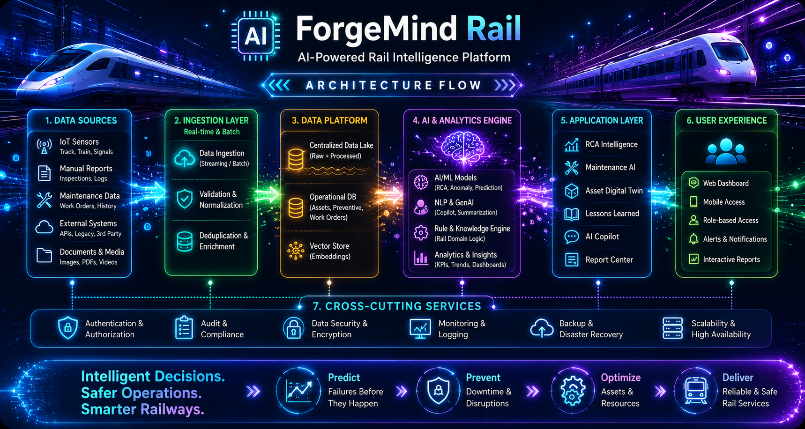
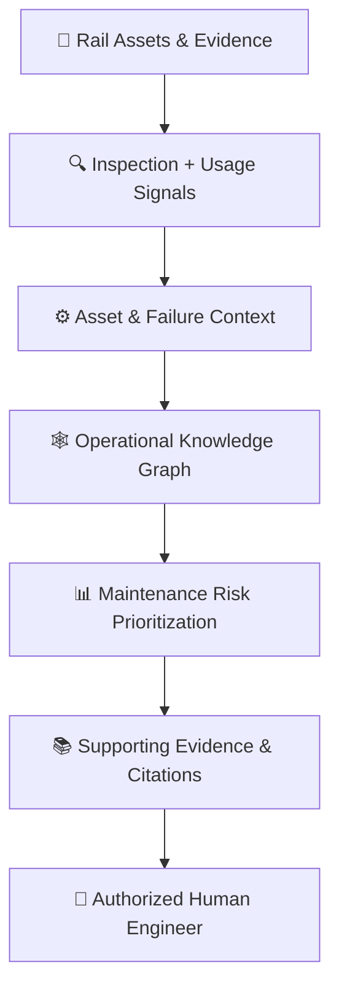
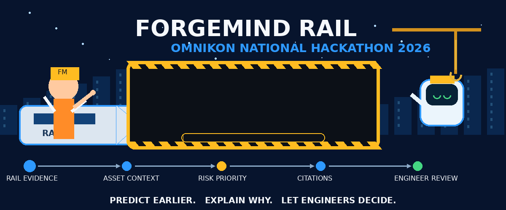
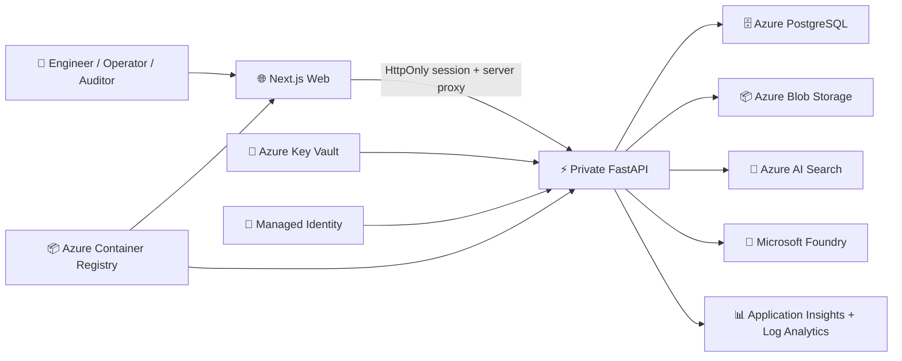

<div align="center">



<br/>

# 🧠 ForgeMind AI

### Evidence-Grounded Industrial Intelligence Platform

> Turn fragmented engineering evidence into cited, explainable operational decisions.

<br/>

<a href="docs/AZURE_ARCHITECTURE.md">
  
</a>
<a href="#-deployment-status">
  
</a>
<a href="docs/AZURE_ARCHITECTURE.md">
  
</a>
<a href="docs/DEPLOYMENT_STATUS.md">
  
</a>

<br/><br/>


</div>

---

# 🚆 ForgeMind Rail — Omnikon National Hackathon 2026

**Domain:** Transportation & Logistics

**Problem Statement:** `Omni_Transport_8 — Predictive Maintenance for Rail Infrastructure`

**Hackathon Application:** ForgeMind Rail

> ForgeMind Rail applies ForgeMind AI's evidence-grounded intelligence architecture to rail maintenance—connecting inspection, usage, failure, maintenance, and engineering evidence so teams can identify emerging maintenance priorities before infrastructure failure.

**Predict earlier. Explain why. Let engineers decide.**

> [!IMPORTANT]
> ForgeMind Rail is currently an Omnikon hackathon application profile
> demonstrated using synthetic rail data. It does not represent a production
> railway deployment, autonomous train control, or certified railway safety system.

---

## The Rail Maintenance Problem

- Rail assets generate inspection, usage, failure, and maintenance evidence across disconnected systems and documents.
- Early warning signals can remain fragmented across inspection reports, work orders, asset histories, and engineering procedures.
- A maintenance score without supporting evidence is difficult for engineers to trust and act upon.
- Critical maintenance decisions require traceability and human engineering judgment.

---

## The ForgeMind Rail Approach



> **The goal is not simply to produce a risk score. The goal is to explain why an asset requires attention and show the evidence behind that recommendation.**

---

## Why ForgeMind Rail Is Different

### 1. Risk + Evidence
Maintenance priority is connected to the inspection, usage, failure, work-order, and engineering evidence behind it.

### 2. Asset-Centric Intelligence
ForgeMind connects fragmented records around the asset rather than treating documents as isolated files.

### 3. Explainability by Design
Analytical and AI-assisted outputs trace back to supporting evidence through inline citations and confidence metadata.

### 4. Human Decision Boundary
ForgeMind supports engineers; it does not autonomously authorize maintenance or control railway equipment.

> **Decision-support boundary:** ForgeMind Rail does not control trains, actuate railway equipment, automatically authorize maintenance, or replace qualified railway engineers.

---

## ⚡ 5-Minute Judge Path

| Step | What to review | Where |
|------|----------------|-------|
| 1 | Understand the rail maintenance problem | ↑ [The Rail Maintenance Problem](#the-rail-maintenance-problem) |
| 2 | Review the evidence-to-maintenance workflow | ↑ [The ForgeMind Rail Approach](#the-forgemind-rail-approach) |
| 3 | Inspect the synthetic rail demonstration dataset | [`demo-data/rail/`](demo-data/rail/) |
| 4 | Review Asset 360, maintenance, and RCA capabilities | ↓ [Key Capabilities](#-key-capabilities) |
| 5 | Examine evidence-grounded citations and traceability | ↓ [Verified Operational Evidence](#-verified-operational-evidence) |
| 6 | Review security, RBAC, and human decision boundaries | [`SECURITY.md`](SECURITY.md) · ↓ [Safety & Human Control](#-safety--human-control) |
| 7 | Review Omnikon-specific documentation | [`docs/OMNIKON_2026.md`](docs/OMNIKON_2026.md) |

---

## Built on the Existing ForgeMind AI Platform

ForgeMind Rail is not a standalone concept. It is an application profile built on the existing ForgeMind AI industrial intelligence platform—a working evidence-grounded decision-support system with verified ingestion, retrieval, entity extraction, knowledge graph, asset intelligence, maintenance intelligence, root-cause analysis, citations, RBAC, and human review.

<div align="center">

### 📄 Documents → ⚙️ Assets → 🔧 Failures → 📋 Procedures → 🛠️ Work Orders → 🔍 Inspections → ⚖️ Regulations → 🧠 Cited Decisions

</div>

### Verified platform workflow

1. 📥 Ingest PDF, text, image, spreadsheet, and CSV evidence
2. 🔐 Record SHA-256 lineage and prevent duplicate ingestion
3. 🧩 Extract text, chunks, entities, and relationships
4. 🕸️ Connect assets, failures, procedures, inspections, work orders, and regulations
5. 🔒 Retrieve role-authorized evidence **before generation**
6. 📚 Produce responses with citations and confidence metadata
7. 🛑 Abstain when evidence is insufficient
8. 👤 Stop at an explicit human authorization boundary

---

## ForgeMind Rail Demonstration Status

| Component | Status |
|---|---|
| ForgeMind AI core platform | ✅ Local verified |
| Rail application profile | 🚆 Omnikon prototype |
| Rail demonstration dataset | 📋 Synthetic |
| Rail production deployment | ⏳ Not deployed |
| Azure architecture | ✅ Validated architecture |
| Autonomous maintenance control | 🚫 Not provided |

### Synthetic rail data

The [`demo-data/rail/`](demo-data/rail/) directory contains a small synthetic dataset of 8 linked rail assets with inspection, usage, failure, and work-order records.

> The rail dataset is synthetic and was created solely to demonstrate the Omnikon use case reproducibly without representing any real railway or metro operator.

---

## Existing ForgeMind Technical Baseline

<div align="center">

| Evidence Type           | Verified Count |
| ----------------------- | -------------: |
| 📄 Documents            |         **29** |
| 🧩 Chunks               |        **969** |
| 🏷️ Entities            |        **552** |
| 🔗 Entity relationships |        **122** |
| 📚 Citations            |        **124** |
| ⚙️ Assets               |         **12** |
| ⚠️ Failures             |         **16** |
| 🛠️ Work orders         |          **5** |
| 🔍 Inspections          |          **6** |
| 📋 Procedures           |          **2** |
| ⚖️ Regulations          |         **10** |

</div>

> These are verified counts from the existing local ForgeMind demonstration corpus. They are not rail-specific predictive-maintenance performance metrics.

> A ForgeMind citation is a traceable reference from generated or analytical output to supporting ingested evidence. It is not an academic reference count.

Additional migration verification:

* ✅ All 29 document paths relinked
* ✅ 52 compared files byte-identical
* ✅ Zero migration conflicts
* ✅ Zero unresolved document paths

See the [Migration Report](docs/MIGRATION_REPORT.md).

Runtime databases, generated reports, migrated snapshots, and binary evidence remain deliberately excluded from the public repository.

---

# 🔎 Evaluation Evidence

> [!NOTE]
> The bundled eight-case local corpus is a **development smoke test**, not a conference-quality benchmark.

| Metric                         | Verified local result |
| ------------------------------ | --------------------: |
| ✅ Cases passed                 |             **8 / 8** |
| 🎯 Positive retrieval cases    |                 **6** |
| 🛑 Negative abstention cases   |                 **2** |
| 📈 Mean Recall@5               |              **1.00** |
| 🥇 Mean reciprocal rank        |              **1.00** |
| ✅ Negative abstention accuracy |              **1.00** |
| ⚡ Retrieval latency p50        |           **1.68 ms** |
| ⚡ Retrieval latency p95        |           **1.73 ms** |

> The 8/8 result is an existing ForgeMind development retrieval smoke test. It is not rail predictive-maintenance accuracy.

Evaluation results:

```text
backend/evaluation/results/local_phase3.json
```

Research methodology:

📘 [Conference Research Plan](docs/CONFERENCE_RESEARCH_PLAN.md)

---

# 🎬 ForgeMind AI — Product Demo

<div align="center">

### See the complete evidence-to-decision workflow in action.

**From fragmented industrial evidence to governed, cited operational intelligence.**

<br/>

<p align="center">
  
</p>

<p align="center">
  <strong>🚧 ForgeMind Rail Interactive Demo — Under Construction</strong><br/>
  The Round 1 repository currently demonstrates the rail use case through
  synthetic rail evidence, architecture, documented workflows, and
  evidence-grounded decision support. The dedicated ForgeMind Rail
  interactive demonstration is currently under development.
</p>

<br/>

*Engineering Evidence → Lineage → Knowledge Graph → Authorized Retrieval →  
Cited Intelligence → Asset & Maintenance Context → RCA → Compliance → Human Review*

</div>

### What the demo shows

The ForgeMind AI product demonstration walks through the verified local
industrial intelligence workflow, including:

- 📊 **Executive Cockpit** — enterprise operational intelligence at a glance
- 📄 **Engineering Documents** — evidence ingestion, document lineage, and source integrity
- 🧠 **Knowledge Copilot** — evidence-grounded answers with citations and confidence
- 🕸️ **Knowledge Graph** — connected assets, failures, procedures, inspections, and work orders
- ⚙️ **Asset 360** — unified asset and maintenance intelligence
- 🔧 **Maintenance Intelligence** — repeated-failure and maintenance context
- 🔍 **Root Cause Analysis** — evidence-supported investigation
- 🛡️ **Compliance OS** — obligations, evidence gaps, and supporting records
- 📈 **Evidence Metrics** — retrieval quality and abstention behavior
- 👤 **Human Review** — the explicit operational decision boundary

> [!IMPORTANT]
> **OPERATIONAL ACTION: NOT EXECUTED**
>
> The demonstration shows ForgeMind AI as an evidence-grounded
> decision-support platform. It does not demonstrate autonomous control
> or execution of industrial actions.
>
> **Models explain. Evidence supports. Backend gates. Humans authorize.**

<div align="center">


</div>

---

# ✨ Key Capabilities

<table>
<tr>
<td width="50%" valign="top">

## 📚 Evidence Intelligence

* Multi-format ingestion
* PDF, text, image, CSV, spreadsheet support
* SHA-256 lineage
* Duplicate prevention
* Chunk extraction
* Entity extraction
* Relationship extraction
* Inline citations
* Confidence metadata
* Evidence insufficiency detection
* Abstention

</td>
<td width="50%" valign="top">

## ⚙️ Operational Intelligence

* Asset 360
* Operational knowledge graph
* Maintenance history
* Failure pattern intelligence
* Repeated-failure analysis
* Root cause analysis
* Work-order context
* Inspection intelligence
* Risk ranking

</td>
</tr>

<tr>
<td width="50%" valign="top">

## 🛡️ Governance

* JWT authentication
* Backend-authoritative RBAC
* Role filtering before retrieval
* Evidence sufficiency gates
* Human review
* Auditability
* Source lineage
* Explicit non-execution boundary

</td>
<td width="50%" valign="top">

## ⚖️ Compliance & Reporting

* Compliance gap views
* Applicable obligations
* Evidence packages
* Inspection evidence
* Root-cause reports
* PDF report generation
* Lessons learned
* Executive insights

</td>
</tr>
</table>

---

# 🏗️ Architecture Summary



Only the web application has public ingress in the Azure design.

Browser requests to `/api/*` are proxied by Next.js to the internal FastAPI application.

PostgreSQL uses delegated networking and private DNS.

Key Vault references and managed identity keep Azure credentials out of application images.

<div align="center">

### 🔐 Backend access controls and evidence sufficiency remain authoritative.

### ☁️ Azure architecture validated · Runtime not yet deployed

</div>

📘 Full details: [Azure Architecture](docs/AZURE_ARCHITECTURE.md)

---

# 🧠 Evidence-Grounded AI Lifecycle

<table>
<tr>
<td width="33%" valign="top">

### 🧪 Local Deterministic Mode

* SQLite persistence
* Local document storage
* Deterministic embeddings
* Deterministic retrieval
* Evidence-grounded responses
* No paid AI credentials required
* Reproducible testing

</td>
<td width="33%" valign="top">

### ☁️ Microsoft Foundry Mode

* Microsoft Foundry chat models
* Foundry embeddings
* Azure AI Search
* Hybrid/vector retrieval
* Azure-native persistence
* Managed identity
* Enterprise cloud profile

**Configured architecture — not currently deployed**

</td>
<td width="33%" valign="top">

### 🛡️ Backend Authority

FastAPI remains authoritative for:

* Access control
* Role filtering
* Retrieval inputs
* Evidence sufficiency
* Document lineage
* Graph queries
* RCA
* Compliance
* Audit records
* Report generation

</td>
</tr>
</table>

<div align="center">

## **Models explain. Evidence supports. Backend gates. Humans authorize.**

</div>

No model can override access filters, fabricate permission, or execute industrial action.

---

# 🤝 Intelligence-Agent Orchestration

ForgeMind includes an orchestrator and bounded specialist agents.

| Agent                                 | Responsibility                                    |
| ------------------------------------- | ------------------------------------------------- |
| 📄 **Document Intelligence Agent**    | Evidence extraction and document understanding    |
| 🕸️ **Knowledge Graph Agent**         | Entity and relationship intelligence              |
| 🔧 **Maintenance Intelligence Agent** | Maintenance history and repeated-failure analysis |
| 🔍 **Root Cause Analysis Agent**      | Evidence-grounded causal investigation            |
| 🛡️ **Compliance Agent**              | Obligations, gaps, and supporting evidence        |
| 📚 **Lessons Learned Agent**          | Human-reviewed organizational learning            |
| 📊 **Executive Insights Agent**       | Operational summaries and decision context        |

> All agents operate on backend-produced evidence and structured outputs.
>
> **Their findings are advisory and inherit ForgeMind's authorization, citation, and human-review constraints.**

---

# 🌐 Deployment Status

| Environment           | Status                        | Evidence                                                                                            |
| --------------------- | ----------------------------- | --------------------------------------------------------------------------------------------------- |
| 💻 Local              | ✅ `IMPLEMENTED_AND_VERIFIED`  | Complete deterministic workflow, migrated evidence access, reproducible validation                  |
| ☁️ Azure architecture | ✅ `IMPLEMENTED_AND_VALIDATED` | Bicep, identity, networking, data, AI, observability, containers, OIDC deployment definitions       |
| 🌍 Azure runtime      | ⏳ `NOT_DEPLOYED`              | Subscription deployment, quota validation, resource creation, and live smoke testing remain pending |

> [!WARNING]
> **There is currently no public Azure ForgeMind product URL.**
>
> Repository infrastructure definitions demonstrate deployment readiness. They are **not proof of a running Azure environment**.

### Verified local application

```text
Product
http://localhost:3000/

Executive Cockpit
http://localhost:3000/platform/dashboard

FastAPI documentation
http://localhost:8000/docs
```

No Azure resources or charges were created during repository preparation.

---

# 💡 Enterprise Value

| Enterprise signal                  | ForgeMind evidence                                                                        |
| ---------------------------------- | ----------------------------------------------------------------------------------------- |
| ⚡ Faster engineering investigation | Unified search across manuals, SOPs, incidents, inspections, and work orders              |
| 🔎 Traceable AI                    | Source documents, chunks, citations, confidence, and lineage retained with each answer    |
| ⚙️ Asset intelligence              | Operational graph, Asset 360, failure patterns, maintenance history, and risk ranking     |
| 🛡️ Compliance readiness           | Evidence gaps, applicable obligations, inspections, and exportable RCA reports            |
| 👤 Bounded authority               | Role filtering precedes retrieval; unsupported questions abstain; humans retain authority |
| ☁️ Cloud portability               | Deterministic local adapters plus a separate Azure-native runtime profile                 |

---

# 🎬 Guided Product Demo

## Recommended Five-Minute Judge Flow

### 1️⃣ Executive Cockpit

`/platform/dashboard`

Start with the enterprise operational picture.

Show:

* evidence totals
* asset context
* current intelligence
* operational risk
* decision-support summary

---

### 2️⃣ Engineering Documents

`/platform/documents`

Demonstrate:

* migrated evidence
* document types
* source lineage
* SHA-256 identity
* accessible evidence

---

### 3️⃣ Knowledge Copilot

`/platform/copilot`

Ask an engineering question.

Show:

* authorized retrieval
* evidence-grounded response
* citations
* confidence
* abstention behavior

---

### 4️⃣ Knowledge Graph

`/platform/graph`

Move from isolated evidence to connected operational context.

Show relationships across:

* assets
* failures
* procedures
* inspections
* work orders
* regulations

---

### 5️⃣ Entity Intelligence

`/platform/entities`

Explore extracted entities and their evidence context.

---

### 6️⃣ Digital Twin / Asset 360

`/platform/assets`

Demonstrate:

* asset history
* maintenance context
* failures
* procedures
* inspection evidence

---

### 7️⃣ Maintenance AI

`/platform/maintenance`

Show repeated-failure and maintenance intelligence.

---

### 8️⃣ Root Cause Analysis

`/platform/rca`

Demonstrate an evidence-supported investigation and report-generation workflow.

---

### 9️⃣ Compliance OS

`/platform/compliance`

Show:

* applicable obligations
* supporting evidence
* compliance gaps
* inspection records

---

### 🔟 Evidence Metrics

`/platform/evaluation`

Close with:

* retrieval quality
* abstention behavior
* evidence grounding
* governance

---

### 👤 Final Boundary

Finish by reinforcing:

> **ForgeMind provides decision support.**
>
> **Industrial action remains under authorized human control.**

📘 Full walkthrough: [Demo Script](docs/DEMO_SCRIPT.md)

---

# 🧭 Product Routes

| Product area             | Route                   |
| ------------------------ | ----------------------- |
| 🏠 Landing page          | `/`                     |
| 🎛️ Executive Cockpit    | `/platform/dashboard`   |
| 🧠 Knowledge Copilot     | `/platform/copilot`     |
| 📄 Engineering Documents | `/platform/documents`   |
| 🕸️ Knowledge Graph      | `/platform/graph`       |
| 🧩 Entity Intelligence   | `/platform/entities`    |
| ⚙️ Digital Twin / Assets | `/platform/assets`      |
| 🔧 Maintenance AI        | `/platform/maintenance` |
| 🔍 Root Cause Analysis   | `/platform/rca`         |
| 🛡️ Compliance OS        | `/platform/compliance`  |
| 📚 Lessons Learned       | `/platform/lessons`     |
| 📊 Reports               | `/platform/reports`     |
| 🧪 Evidence Metrics      | `/platform/evaluation`  |
| 🔐 Administration        | `/platform/admin`       |

---

# 📂 Enterprise Solution Repository

```text
ForgeMind AI
│
├── 🌐 Product Experience
│   ├── Executive Cockpit
│   ├── Knowledge Copilot
│   ├── Engineering Documents
│   ├── Knowledge Graph
│   ├── Asset 360
│   ├── Maintenance Intelligence
│   ├── Root Cause Analysis
│   ├── Compliance OS
│   └── Reports & Evaluation
│
├── 🧠 Backend Intelligence
│   ├── Ingestion & document lineage
│   ├── Retrieval & evidence sufficiency
│   ├── Entity extraction
│   ├── Operational graph
│   ├── Maintenance intelligence
│   ├── Root cause analysis
│   ├── Compliance services
│   ├── Agent orchestration
│   └── Authentication / RBAC / Audit
│
├── ☁️ Azure-Native Delivery
│   ├── Container Apps
│   ├── Container Registry
│   ├── PostgreSQL Flexible Server
│   ├── Blob Storage
│   ├── Azure AI Search
│   ├── Microsoft Foundry
│   ├── Key Vault
│   ├── Managed Identity
│   └── Application Insights / Log Analytics
│
└── 🛡️ Evidence & Governance
    ├── Citations
    ├── Confidence
    ├── Migration manifest
    ├── Evaluation results
    ├── Human decision boundary
    └── Architecture & research documentation
```

---

# 🧱 Repository Modules

| Module               | Enterprise responsibility                                                                                     |
| -------------------- | ------------------------------------------------------------------------------------------------------------- |
| `frontend/`          | Next.js and TypeScript product experience, dashboards, graph, evidence, RCA, governance views                 |
| `backend/`           | FastAPI APIs, authentication, RBAC, ingestion, retrieval, AI providers, graph, compliance, reports, audit     |
| `infra/`             | Azure Bicep for containers, PostgreSQL, Blob, Search, Foundry, Key Vault, identity, networking, observability |
| `demo-data/`         | Synthetic evidence for deterministic demonstrations                                                           |
| `sample_data/`       | Local evidence examples and dataset guidance                                                                  |
| `docs/`              | Architecture, deployment, API, safety, research, migration, and conference material                           |
| `.github/workflows/` | Manual OIDC-based Azure deployment workflow                                                                   |

---

# ⚙️ Technology Stack

| Layer               | Technology                                                                 |
| ------------------- | -------------------------------------------------------------------------- |
| 🌐 Experience       | Next.js 15, React 18, TypeScript, Tailwind CSS                             |
| 📊 Visualization    | TanStack Query, Recharts, React Flow, D3                                   |
| ⚡ API               | Python, FastAPI, Pydantic v2                                               |
| 🗄️ Persistence     | SQLAlchemy, Alembic, SQLite / PostgreSQL                                   |
| 📦 Evidence storage | Local document storage / Azure Blob Storage                                |
| 🔎 Retrieval        | Deterministic local retrieval / Azure AI Search                            |
| 🧠 AI               | Deterministic local provider / Microsoft Foundry                           |
| 🔐 Identity         | JWT/RBAC locally / managed identity & Key Vault in Azure                   |
| 📡 Observability    | OpenTelemetry, Application Insights, Log Analytics                         |
| ☁️ Delivery         | Docker, Bicep, Azure Container Registry, Container Apps                    |
| 🔄 CI/CD            | GitHub Actions + OIDC                                                      |
| 🧪 Quality          | Pytest, Python compile checks, TypeScript, Next.js build, Bicep validation |

---

# 🔐 Safety & Human Control

Security and governance controls include:

* 🔑 Signed JWT authentication
* 🛡️ Backend-authoritative RBAC
* 🔒 Role filtering before retrieval and generation
* 🍪 HttpOnly, Secure, SameSite session-cookie design
* 🌐 Private API ingress in the Azure architecture
* 🗄️ Private PostgreSQL networking and DNS
* 🪪 Managed identity
* 🔐 Key Vault secret references
* 🔗 SHA-256 lineage
* 📚 Citation requirements
* 🛑 Evidence-sufficiency guardrails
* 👤 Explicit human review

Demo identities are intended for local evaluation only.

Shared or production environments must replace demo credentials with enterprise identity, managed RBAC, SSO, and rotated high-entropy secrets.

---

# 🚦 Human Decision Boundary

<div align="center">

## 🧠 AI Can

Explain evidence
Identify patterns
Retrieve authorized knowledge
Support RCA
Surface compliance gaps
Prepare reports
Generate cited recommendations

<br/>

## 🚫 AI Cannot

Start equipment
Stop equipment
Isolate systems
Repair machinery
Approve maintenance
Override access controls
Modify industrial configuration
Execute production actions

<br/>

# 👤 Humans Decide.

</div>

---

# 📡 Observability

ForgeMind initializes Azure Monitor OpenTelemetry when an Application Insights connection string is configured.

The Azure architecture targets structured telemetry through:

* 📊 Application Insights
* 🧾 Log Analytics
* 🔍 Azure Monitor
* 🔗 OpenTelemetry

> Local verification confirms instrumentation initialization and application behavior.
>
> It does **not** claim exported Azure traces, production dashboards, alerts, or live telemetry without a deployed Azure resource and trace evidence.

---

# ☁️ Azure Deployment Architecture

```text
GitHub
   │
   ▼
🔐 GitHub OIDC
   │
   ▼
☁️ Azure Resource Manager / Bicep
   │
   ├── 🌐 Virtual Network
   ├── 📦 Azure Container Registry
   ├── 🗄️ PostgreSQL Flexible Server
   ├── 📁 Blob Storage
   ├── 🔎 Azure AI Search
   ├── 🧠 Microsoft Foundry
   ├── 🔐 Key Vault
   ├── 🪪 Managed Identity
   ├── 📊 Application Insights
   ├── 🧾 Log Analytics
   └── 📦 Azure Container Apps
        ├── 🌍 Public ForgeMind Web
        └── 🔒 Private ForgeMind API
```

The workflow at:

```text
.github/workflows/azure-deploy.yml
```

is intentionally manual.

It:

1. authenticates through GitHub OIDC
2. provisions shared Azure infrastructure
3. builds API and web images
4. stores images in Azure Container Registry
5. deploys Container Apps
6. publishes the frontend URL to the workflow summary

### Required GitHub secrets

```text
AZURE_CLIENT_ID
AZURE_TENANT_ID
AZURE_SUBSCRIPTION_ID
POSTGRES_ADMIN_PASSWORD
JWT_SECRET
```

> [!WARNING]
> Bicep templates, workflows, containers, identity configuration, and deployment scripts demonstrate **implementation readiness**.
>
> They do not demonstrate a live Azure deployment.

---

# 💻 Running Locally

## Prerequisites

* Python 3.11+
* Node.js 20+
* pnpm

Copy:

```text
.env.example
```

to:

```text
.env
```

The default configuration uses SQLite, local retrieval, and the deterministic local provider.

---

## ⚡ Backend

```powershell
Set-Location backend

python -m venv .venv

.\.venv\Scripts\Activate.ps1

python -m pip install -r requirements.txt

python -m uvicorn app.main:app --reload --host 127.0.0.1 --port 8000
```

---

## 🌐 Frontend

```powershell
Set-Location frontend

corepack enable

pnpm install

pnpm dev
```

Open:

```text
http://localhost:3000/
```

API documentation:

```text
http://localhost:8000/docs
```

Docker Compose is also included for PostgreSQL, Redis, ChromaDB, backend, and frontend services.

The default deterministic application path does not require paid Azure services.

---

# 🧪 Testing & Verification

```powershell
python -m pytest backend/tests -q

python -m compileall -q backend/app backend/tests
```

Frontend:

```powershell
Set-Location frontend

pnpm build
```

Infrastructure:

```powershell
az bicep build --file infra/main.bicep
```

### Verified preparation evidence

* ✅ 18 backend tests passed
* ✅ Python compile checks passed
* ✅ TypeScript validation passed
* ✅ Next.js production build passed
* ✅ 23 frontend routes compiled
* ✅ Bicep compiled without diagnostics
* ✅ Local retrieval smoke corpus passed **8 / 8**

---

# ✅ Implementation Readiness

| Readiness area        | Evidence-backed outcome                                                                                    |
| --------------------- | ---------------------------------------------------------------------------------------------------------- |
| 🌐 Product experience | ✅ Landing, dashboard, documents, copilot, graph, assets, maintenance, RCA, compliance, reports, evaluation |
| 📚 Evidence platform  | ✅ 29 documents, 969 chunks, 552 entities, 122 relationships, 124 citations                                 |
| 👤 Human control      | ✅ Access filters, citations, abstention, explicit non-execution boundary                                   |
| 🧪 Local quality      | ✅ Backend tests, compilation, TypeScript, frontend build, APIs, browser verification                       |
| ☁️ Azure architecture | 🟦 Bicep, containers, OIDC, identity, networking, data, AI, observability prepared                         |
| 🌍 Live Azure runtime | ⏳ Not deployed; quota, resources, endpoints, and cloud smoke evidence remain pending                       |

---

# 📚 Documentation

| Document                                                        | Purpose                                                         |
| --------------------------------------------------------------- | --------------------------------------------------------------- |
| 🚆 [Omnikon 2026](docs/OMNIKON_2026.md)                         | ForgeMind Rail hackathon problem statement and solution          |
| 🏗️ [Azure Architecture](docs/AZURE_ARCHITECTURE.md)            | Trust boundaries, identity, networking, persistence, AI, safety |
| ☁️ [Infrastructure Guide](infra/README.md)                      | Azure deployment and GitHub Actions                             |
| 🚦 [Deployment Status](docs/DEPLOYMENT_STATUS.md)               | Verified, ready, pending, and external prerequisites            |
| 🗄️ [Migration Report](docs/MIGRATION_REPORT.md)                | Migration evidence and integrity verification                   |
| 🧪 [Conference Research Plan](docs/CONFERENCE_RESEARCH_PLAN.md) | Evaluation design, acceptance gates, and ablations              |
| ⚡ [API Reference](docs/API.md)                                  | Backend endpoints                                               |
| 🧱 [Architecture](docs/ARCHITECTURE.md)                         | Application components and data flow                            |
| 🧠 [System Design](docs/SYSTEM_DESIGN.md)                       | Product-level architecture                                      |
| 🗃️ [Database Diagram](docs/DATABASE_DIAGRAM.md)                | Persistence entities and relationships                          |
| 🚀 [Deployment Guide](docs/DEPLOYMENT_GUIDE.md)                 | Local and deployment guidance                                   |
| 🎬 [Demo Script](docs/DEMO_SCRIPT.md)                           | Conference demonstration sequence                               |

---

# ⚠️ Known Limitations

ForgeMind intentionally documents its current boundaries.

* Azure resources have not yet been deployed from this workspace
* Microsoft Foundry model availability depends on subscription-specific quota
* Azure AI Search quality and latency require a live held-out benchmark
* The eight-case local retrieval suite is a development smoke test
* Some secondary UI cards remain curated conference demonstration views
* The deterministic local provider supports reproducibility but does not replace managed-model evaluation
* SQLite is suitable for local verification, not distributed production workloads
* Stricter production security may require private endpoints for Search, Storage, Foundry, and Key Vault
* Raw migrated documents and database snapshots are intentionally absent from the public repository
* ForgeMind provides decision support only
* **ForgeMind does not execute industrial actions**

---

## Team — Omnikon National Hackathon 2026

- **Janice Benita F** — Team Leader
- **Tytus Glastin** ([@TytusGlastin](https://github.com/TytusGlastin)) — Frontend Development

---

## Generative AI Usage Disclosure

Generative AI tools, including OpenAI Codex and other AI-assisted software
engineering tools, were used during development for assistance with code,
refactoring, documentation, and testing.

All architecture decisions, review, validation, and hackathon submission
responsibility remain with the registered team.

---

## 📄 License

ForgeMind AI is released under the [MIT License](LICENSE).

Third-party libraries, services, trademarks, datasets, and external materials remain subject to their respective licenses and terms.

---

# 👤 Author & Hackathon Team

<div align="center">

### ForgeMind AI — created by **Janice Benita F**

### Omnikon 2026 submission team: **Janice Benita F** & **Tytus Glastin**

<br/>

### 🧠 ForgeMind AI

### Azure-Native Industrial Intelligence Platform

<br/>

## **Connect evidence. Understand operations. Decide with confidence.**

<br/>

**Evidence Grounded · Human Governed · Azure Native**

### **Operational Action: NOT EXECUTED**

</div>

---

<div align="center">

⭐ If ForgeMind AI is useful to your work, consider starring the repository.

</div>
