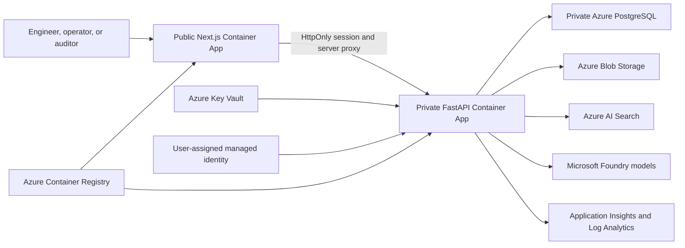

# ForgeMind AI

## Azure-Native Industrial Intelligence Platform

**Turn fragmented engineering evidence into cited operational decisions.**

[](docs/AZURE_ARCHITECTURE.md)
[](frontend/)
[](backend/)
[](#-safety-and-human-control)
[](docs/DEPLOYMENT_STATUS.md)

**Next.js · FastAPI · Azure Container Apps · PostgreSQL · Blob Storage · Azure AI Search · Microsoft Foundry**

[Quick start](#-running-locally) · [Architecture](#-architecture-summary) · [Product routes](#-guided-product-demo) · [Azure deployment](#-azure-deployment) · [Evaluation evidence](#-evaluation-evidence)

### 30-second ForgeMind flow

**Ingest evidence → preserve lineage → extract entities → build the operational graph → retrieve authorized chunks → answer with citations → require human review**

ForgeMind AI is a conference-ready industrial knowledge and decision-support platform for engineering documents, work orders, inspection reports, SOPs, incidents, quality records, and compliance evidence.

> [!IMPORTANT]
> **OPERATIONAL ACTION: NOT EXECUTED**
>
> ForgeMind AI explains evidence, identifies risks, supports RCA, and prepares compliance findings. It does not start, stop, isolate, repair, approve, or reconfigure industrial equipment. Every operational, safety, maintenance, quality, and compliance action requires an authorized human decision.

## 🌐 Deployment status

| Environment | Status | Purpose |
|---|---|---|
| Local | `IMPLEMENTED_AND_VERIFIED` | Complete offline product, migrated evidence access, deterministic retrieval, and reproducible validation |
| Azure architecture | `IMPLEMENTED_AND_VALIDATED` | Bicep, identity, networking, data, AI, observability, container, and OIDC deployment definitions |
| Azure runtime | `NOT_DEPLOYED` | Azure subscription deployment, quota validation, and live smoke testing remain pending |

There is currently **no public Azure product URL**. The verified local application runs at:

- Product: `http://localhost:3000/`
- Executive Cockpit: `http://localhost:3000/platform/dashboard`
- API documentation: `http://localhost:8000/docs`

No Azure resources or charges were created during repository preparation.

## 🎯 Project overview

ForgeMind AI converts disconnected industrial evidence into an access-controlled operational intelligence layer. Its verified local workflow:

1. ingests PDF, text, image, spreadsheet, and CSV evidence;
2. records SHA-256 lineage and prevents duplicate ingestion;
3. extracts text, chunks, entities, and relationships;
4. connects assets, failures, procedures, inspections, work orders, and regulations;
5. retrieves role-authorized evidence before generation;
6. answers with citations and confidence metadata;
7. abstains when the evidence is insufficient; and
8. keeps decisions at a human authorization boundary.

| Enterprise signal | Product evidence |
|---|---|
| Faster engineering investigation | Unified search across manuals, SOPs, incidents, inspections, and work orders |
| Traceable AI | Source documents, chunks, citations, confidence, and lineage are retained with each answer |
| Asset intelligence | Operational graph, Asset 360, failure patterns, maintenance history, and risk ranking |
| Compliance readiness | Evidence gaps, applicable obligations, inspections, and exportable RCA reports |
| Bounded authority | Role filtering precedes retrieval; unsupported questions abstain; humans retain decision authority |
| Cloud portability | Deterministic local adapters and a separate Azure-native runtime profile |

## 🏗️ Architecture summary



Only the web application has public ingress in the Azure design. Browser requests to `/api/*` are proxied by Next.js to the internal FastAPI application. PostgreSQL uses delegated networking and private DNS. Key Vault references and managed identity keep cloud credentials out of application images.

The complete trust and request flow is documented in [Azure architecture](docs/AZURE_ARCHITECTURE.md), with deployment details in [infra/README.md](infra/README.md).

## 🧠 AI lifecycle and authority

### Local deterministic mode

The default developer configuration uses SQLite, deterministic local embeddings and retrieval, and evidence-grounded response construction. It works without paid AI credentials and supports reproducible tests.

### Microsoft Foundry mode

When Azure services and identity are configured, Microsoft Foundry supplies chat and embedding models while Azure AI Search supplies hybrid, vector-aware retrieval. Model output remains evidence-bound and advisory.

### Backend authority

The FastAPI backend remains authoritative for:

- document access and role filtering;
- lineage and duplicate checks;
- retrieval inputs and evidence sufficiency;
- entity, graph, maintenance, RCA, and compliance queries;
- audit records and report generation; and
- the final decision-support boundary.

No model can override access filters, fabricate permission, or execute an industrial action.

## 🤝 Intelligence-agent orchestration

ForgeMind includes an orchestrator and bounded specialist agents:

- Document Intelligence Agent;
- Knowledge Graph Agent;
- Maintenance Intelligence Agent;
- Root Cause Analysis Agent;
- Compliance Agent;
- Lessons Learned Agent; and
- Executive Insights Agent.

Agents operate on backend-produced evidence and structured outputs. Their findings are advisory and inherit the same authorization and citation constraints as the rest of the platform.

## 🗄️ Data and migration architecture

The separate ForgeMind workspace recovered the verifiable local Intelligence Brain corpus while leaving the source project unchanged.

| Migrated record type | Verified count |
|---|---:|
| Documents | 29 |
| Chunks | 969 |
| Entities | 552 |
| Entity relationships | 122 |
| Citations | 124 |
| Assets | 12 |
| Failures | 16 |
| Work orders | 5 |
| Inspections | 6 |
| Procedures | 2 |
| Regulations | 10 |

All 29 document paths were relinked, 52 compared files were byte-identical, and the migration found zero conflicts or unresolved document paths. See the [migration report](docs/MIGRATION_REPORT.md) and `backend/migration/legacy_migration_manifest.json`.

Runtime databases, generated reports, migrated snapshots, and binary evidence files are deliberately excluded from this public repository. They remain in the authorized local workspace and can be migrated with `backend/scripts/migrate_legacy_data.py`.

## ✨ Key features

- Evidence-gated industrial copilot with inline citations
- Multi-format document ingestion and extraction
- SHA-256 document lineage and duplicate prevention
- Role-aware retrieval before generation
- Asset 360 and operational knowledge graph
- Maintenance history and repeated-failure intelligence
- Root cause analysis with PDF report generation
- Compliance gap and evidence-package views
- Human-reviewed lessons learned and executive insights
- Local and Azure provider adapters
- PostgreSQL and SQLite persistence modes
- Blob Storage and local document-storage modes
- Azure AI Search and deterministic local retrieval modes
- OpenTelemetry-compatible Azure Monitor instrumentation
- Reproducible retrieval evaluation with Recall@K, MRR, abstention, and latency

## 🔎 Evaluation evidence

The bundled eight-case local corpus is a **development smoke test**, not a conference-quality benchmark.

| Metric | Verified local result |
|---|---:|
| Cases passed | 8 / 8 |
| Positive retrieval cases | 6 |
| Negative abstention cases | 2 |
| Mean Recall@5 | 1.00 |
| Mean reciprocal rank | 1.00 |
| Negative abstention accuracy | 1.00 |
| Retrieval latency p50 | 1.68 ms |
| Retrieval latency p95 | 1.73 ms |

Results are stored in `backend/evaluation/results/local_phase3.json`. The held-out evaluation design, acceptance gates, ablations, and reporting rules are documented in [Conference research plan](docs/CONFERENCE_RESEARCH_PLAN.md).

## 🎬 Guided product demo

| Product area | Route |
|---|---|
| Landing page | `/` |
| Executive Cockpit | `/platform/dashboard` |
| Knowledge Copilot | `/platform/copilot` |
| Engineering Documents | `/platform/documents` |
| Knowledge Graph | `/platform/graph` |
| Entity Intelligence | `/platform/entities` |
| Digital Twin / Assets | `/platform/assets` |
| Maintenance AI | `/platform/maintenance` |
| Root Cause Analysis | `/platform/rca` |
| Compliance OS | `/platform/compliance` |
| Lessons Learned | `/platform/lessons` |
| Reports | `/platform/reports` |
| Evidence Metrics | `/platform/evaluation` |
| Administration | `/platform/admin` |

A concise demonstration flow is available in [docs/DEMO_SCRIPT.md](docs/DEMO_SCRIPT.md).

## 📂 Enterprise solution repository

| Repository module | Enterprise responsibility |
|---|---|
| `frontend/` | Next.js and TypeScript product experience, server-side API proxy, session handling, dashboards, graph, evidence, RCA, and governance views |
| `backend/` | FastAPI APIs, authentication, RBAC, ingestion, retrieval, AI providers, graph, maintenance, compliance, reports, audit, and persistence adapters |
| `infra/` | Azure Bicep for Container Apps, PostgreSQL, Blob, Search, Foundry, Key Vault, ACR, networking, identity, and observability |
| `demo-data/` | Synthetic text and CSV records for deterministic local demonstrations |
| `sample_data/` | Local evidence examples and dataset guidance |
| `docs/` | Architecture, deployment, API, data model, research, migration, safety, demo, and conference documentation |
| `.github/workflows/` | Manual, OIDC-based two-stage Azure deployment workflow |

## 🏗️ Repository architecture at a glance

```text
ForgeMind AI
│
├── Product experience
│   ├── Executive Cockpit
│   ├── Knowledge Copilot
│   ├── Engineering Documents
│   ├── Asset and Maintenance Intelligence
│   └── Compliance, RCA, reports, and evaluation
│
├── Backend intelligence
│   ├── Ingestion and document lineage
│   ├── Retrieval and evidence sufficiency
│   ├── Entity extraction and operational graph
│   ├── Maintenance, RCA, and compliance services
│   ├── Bounded agent orchestration
│   └── Authentication, RBAC, and audit
│
├── Azure-native delivery
│   ├── Container Apps and Container Registry
│   ├── PostgreSQL Flexible Server
│   ├── Blob Storage and Azure AI Search
│   ├── Microsoft Foundry
│   ├── Key Vault and managed identity
│   └── Application Insights and Log Analytics
│
└── Evidence and governance
    ├── Citations and confidence
    ├── Migration manifest
    ├── Evaluation results
    ├── Human decision boundary
    └── Architecture and research documentation
```

## ⚙️ Technology stack

| Layer | Technology |
|---|---|
| Frontend | Next.js 15, React 18, TypeScript, Tailwind CSS, TanStack Query, Recharts, React Flow, D3 |
| Backend | Python, FastAPI, Pydantic v2, SQLAlchemy, Alembic |
| Local persistence | SQLite and local document storage |
| Azure persistence | PostgreSQL Flexible Server and Blob Storage |
| Retrieval | Deterministic local retrieval or Azure AI Search |
| AI | Local deterministic provider or Microsoft Foundry chat and embeddings |
| Identity and secrets | JWT/RBAC locally; managed identity and Key Vault in Azure |
| Observability | OpenTelemetry, Application Insights, and Log Analytics targets |
| Delivery | Docker, Bicep, Azure Container Registry, Container Apps, GitHub Actions OIDC |
| Quality | Pytest, Python compile checks, TypeScript, Next.js production build, Bicep validation |

## 🔐 Safety and human control

Security and governance controls include:

- signed JWT authentication and backend-authoritative RBAC;
- role filtering before document retrieval and generation;
- HttpOnly, Secure, SameSite session-cookie design;
- private API ingress in the Azure architecture;
- private PostgreSQL networking and DNS;
- managed identity instead of application-managed Azure credentials;
- Key Vault references for database and JWT secrets;
- source lineage and content hashes;
- citation and evidence-sufficiency guardrails; and
- explicit human review for operational decisions.

Demo identities are for local evaluation only. Shared or production environments must replace demo credentials with enterprise identity, SSO, managed RBAC, and rotated high-entropy secrets.

## 📡 Observability

The backend initializes Azure Monitor OpenTelemetry when an Application Insights connection string is configured. The architecture targets structured application telemetry through Application Insights and Log Analytics.

Local verification confirms instrumentation initialization and application behavior. It does not claim exported Azure traces, dashboards, alerts, or live telemetry without a deployed resource ID and trace evidence.

## ☁️ Azure deployment

```text
GitHub
  ↓ OIDC
GitHub Actions
  ↓
Azure Resource Manager / Bicep
  ├── Virtual Network
  ├── Azure Container Registry
  ├── PostgreSQL Flexible Server
  ├── Blob Storage
  ├── Azure AI Search
  ├── Microsoft Foundry
  ├── Key Vault
  ├── Managed Identity
  ├── Application Insights / Log Analytics
  └── Azure Container Apps
      ├── Public ForgeMind Web
      └── Private ForgeMind API
```

The manual workflow at `.github/workflows/azure-deploy.yml`:

1. authenticates to Azure through GitHub OIDC;
2. provisions the shared Azure foundation;
3. builds API and web images in Azure Container Registry;
4. deploys the public web and private API Container Apps; and
5. publishes the frontend URL to the workflow summary.

Required GitHub secrets:

- `AZURE_CLIENT_ID`
- `AZURE_TENANT_ID`
- `AZURE_SUBSCRIPTION_ID`
- `POSTGRES_ADMIN_PASSWORD`
- `JWT_SECRET`

The workflow is manual to prevent accidental cloud spending. Review subscription, region, quota, role assignments, and current Azure pricing before running it.

## 💻 Running locally

### Prerequisites

- Python 3.11+
- Node.js 20+
- pnpm

Copy `.env.example` to `.env`. The defaults use SQLite, local retrieval, and the deterministic local provider.

### Backend

```powershell
Set-Location backend
python -m venv .venv
.\.venv\Scripts\Activate.ps1
python -m pip install -r requirements.txt
python -m uvicorn app.main:app --reload --host 127.0.0.1 --port 8000
```

### Frontend

```powershell
Set-Location frontend
corepack enable
pnpm install
pnpm dev
```

Open `http://localhost:3000/`. API documentation is available at `http://localhost:8000/docs`.

Docker Compose is also included for PostgreSQL, Redis, ChromaDB, the backend, and the frontend. The deterministic default application path does not require paid Azure services.

## 🧪 Testing

```powershell
python -m pytest backend/tests -q
python -m compileall -q backend/app backend/tests

Set-Location frontend
pnpm build
```

Infrastructure validation:

```powershell
az bicep build --file infra/main.bicep
```

Verified preparation evidence:

- 18 backend tests passed;
- Python compile checks passed;
- Next.js production build and TypeScript validation passed;
- 23 frontend routes compiled;
- Bicep compiled without diagnostics; and
- the local retrieval smoke corpus passed 8/8 cases.

## 🔄 CI/CD

The Azure deployment workflow is intentionally `workflow_dispatch` only. It uses:

- GitHub OIDC instead of a stored Azure client secret;
- commit-SHA image tags;
- two-stage infrastructure and application deployment;
- Azure Container Registry builds; and
- a protected `azure-conference` environment boundary.

Configuration files are implementation evidence, not proof of a live Azure deployment. Cloud success must be supported by deployed resource IDs, application URLs, and authenticated smoke-test results.

## ✅ Implementation and verification

| Readiness area | Evidence-backed outcome |
|---|---|
| Product experience | ✅ Landing page, authenticated shell, dashboard, documents, copilot, graph, asset, maintenance, RCA, compliance, reports, and evaluation routes run locally |
| Evidence platform | ✅ 29 documents, 969 chunks, 552 entities, 122 relationships, and 124 citations migrated and API-verified locally |
| Human control | ✅ Access filters, citations, abstention, and explicit non-execution boundary are implemented |
| Local quality | ✅ Backend tests, Python compilation, TypeScript, frontend build, API checks, and browser verification passed |
| Azure architecture | ✅ Bicep, containers, OIDC workflow, identity, secrets, network, data, AI, and observability definitions are prepared |
| Live Azure runtime | ⏳ Not deployed; quota, resource creation, live endpoints, and cloud smoke evidence remain pending |

## 📚 Documentation links

| Document | Purpose |
|---|---|
| [Azure architecture](docs/AZURE_ARCHITECTURE.md) | Trust boundaries, persistence, identity, network, runtime modes, and safety contract |
| [Infrastructure guide](infra/README.md) | Two-stage Azure deployment and GitHub Actions configuration |
| [Deployment status](docs/DEPLOYMENT_STATUS.md) | Verified, ready, pending, and external prerequisite matrix |
| [Migration report](docs/MIGRATION_REPORT.md) | Source preservation, record counts, file verification, and re-run procedure |
| [Conference research plan](docs/CONFERENCE_RESEARCH_PLAN.md) | Held-out study design, metrics, ablations, and reporting controls |
| [API reference](docs/API.md) | Backend endpoints and request contracts |
| [Architecture](docs/ARCHITECTURE.md) | Application components and data flow |
| [System design](docs/SYSTEM_DESIGN.md) | Product-level system design |
| [Database diagram](docs/DATABASE_DIAGRAM.md) | Core persistence entities and relationships |
| [Deployment guide](docs/DEPLOYMENT_GUIDE.md) | Local and deployment operation guidance |
| [Demo script](docs/DEMO_SCRIPT.md) | Conference demonstration sequence |

## ⚠️ Known limitations

- No Azure resources have been deployed from this workspace.
- Foundry model availability and quota require subscription-specific verification.
- Azure AI Search quality and latency require a live held-out benchmark.
- The eight-case local retrieval suite is a development smoke test, not a publishable research result.
- Several secondary UI cards remain curated conference demonstration views; core dashboard totals and the Engineering Documents library use the migrated backend records.
- The local deterministic provider is reproducible but is not a substitute for managed-model evaluation.
- SQLite supports local verification but is not a distributed production datastore.
- Search, Storage, Foundry, and Key Vault authenticated public endpoints require private endpoints for a stricter production network profile.
- Migrated raw documents and database snapshots are intentionally absent from this public repository.
- ForgeMind AI provides decision support only and does not execute industrial actions.

## 👤 Author

Built by **Janice Benita F** as a separate Azure-native industrial intelligence and conference research platform.

**Connect evidence. Understand operations. Decide with confidence.**
