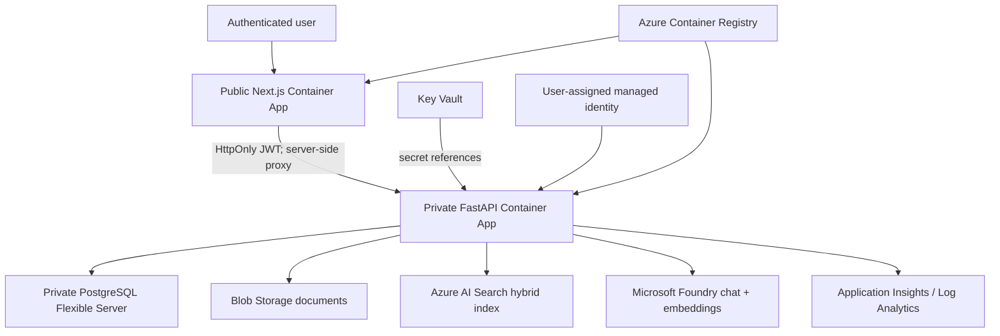

# ForgeMind AI Azure architecture

## Objective

ForgeMind AI is a separate Azure-native industrial RAG platform designed for reproducible evaluation, grounded answers, controlled access, and conference demonstration. It does not depend on the earlier Render deployment.

## Request and trust flow

Only the web application has public ingress. Browser requests to `/api/*` are proxied by Next.js to the internal API FQDN. The bearer token remains in an HttpOnly, Secure, SameSite cookie.

## Persistence

- PostgreSQL stores users, assets, documents, chunks, entities, relationships, maintenance events, inspections, incidents, compliance evidence, copilot history, and audit logs.
- Blob Storage stores immutable source documents under content-addressed names.
- Azure AI Search stores retrievable chunks, embeddings, lineage, and access-control fields.
- Deleting a document removes its Search chunks and Blob object before deleting its metadata. Local mode only removes files inside the configured upload directory.

## Identity and secrets

- One user-assigned managed identity is attached to both Container Apps.
- The API uses `DefaultAzureCredential` with `AZURE_CLIENT_ID`.
- It receives Blob Data Contributor, Search Service Contributor, Search Index Data Contributor, Cognitive Services OpenAI User, ACR Pull, and Key Vault Secrets User roles at the relevant scopes.
- PostgreSQL and JWT values are Key Vault secrets referenced by the Container App; they are not baked into images.
- Storage account keys, Search keys, ACR admin credentials, and Foundry API keys are disabled or unused by the cloud runtime.

## Network boundaries

- Container Apps uses a delegated infrastructure subnet.
- The API Container App uses internal ingress.
- PostgreSQL uses its own delegated subnet, private DNS, and disabled public access.
- Search, Storage, Foundry, and Key Vault currently expose authenticated public service endpoints. Private endpoints are a deliberate hardening follow-up, not a hidden claim.

## Runtime modes

| Mode | Database | AI and retrieval | Purpose |
|---|---|---|---|
| Local | SQLite | deterministic local provider | offline development and tests |
| Azure conference | PostgreSQL | Foundry + Azure AI Search | cloud demo and measured study |

## Safety contract

- Access filters are applied before generation.
- Answers must cite retrieved source chunks.
- Evidence-insufficient questions abstain.
- Maintenance, safety, quality, and compliance outputs remain human-reviewed decision support.
- The small development corpus is not suitable for publication claims.

## Deployment status

The implementation, Bicep template, and GitHub workflow are prepared. They have not been run against an Azure subscription from this workstation, so there is no live ForgeMind Azure URL yet and no Azure cost has been incurred.
